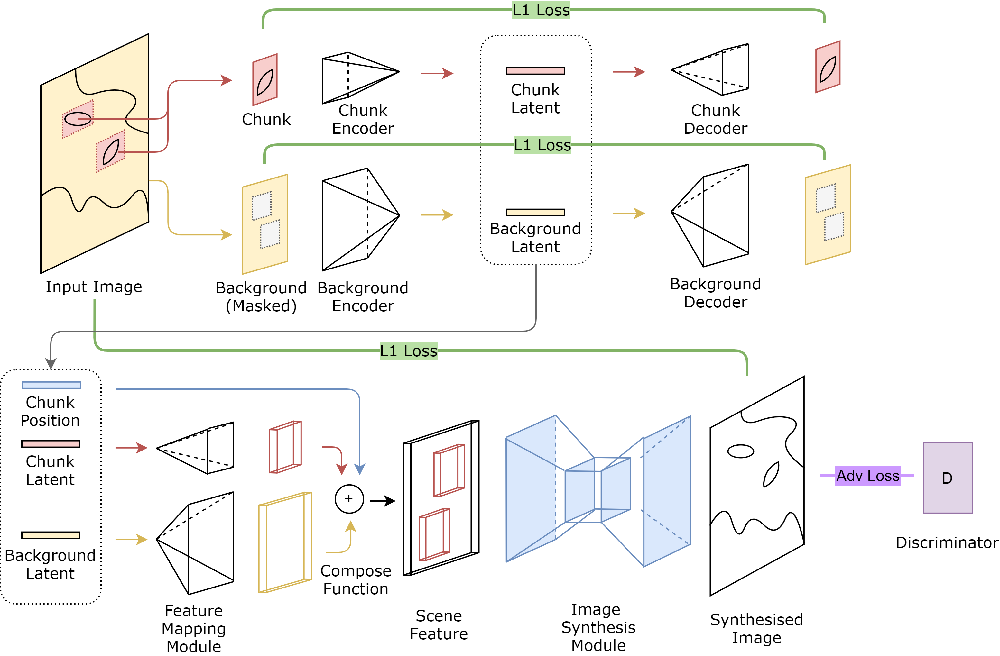

## ChunkGAN: Chunk-based Composable Image Generation



ChunkGAN uses a composable scene representation with decoupled latent code of foreground chunks and background, allowing recomposing objects inside one image.

Still in develop.

### Usage

Training:

```bash
python train.py --config=configs/ships128.json
```

Testing:

```bash
python generate.py --outdir=images/ --config=configs/ships128-eval.json --network=<network_path>
```

